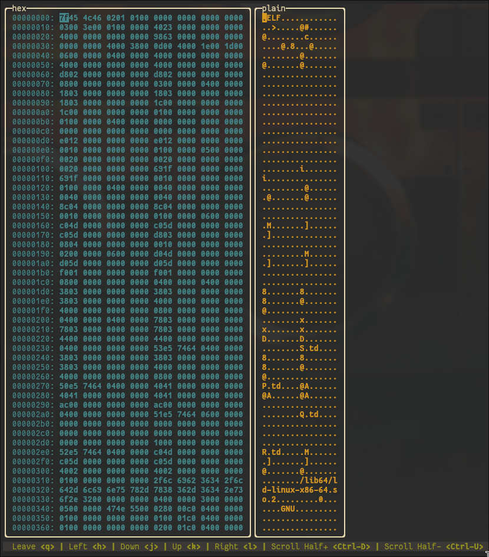

# hexcess
## Description
> [!WARNING]
> hexcess is still in its early phase, therefore a lot of features are missing
> for now. Please keep that in mind when using Hexcess!

hexcess is a (yet another) Ncurses-based hex viewer and editor as well.
It supports basics VIM keybindings for navigating through the hexdump more
easily, more will be supported soon.



## Build
```bash
git clone https://github.com/jeanmadao/hexcess.git
cd hexcess
make
```

## Run
```bash
./hexcess <filename>
```

## Roadmap
- [x] Ncurses interface to view and navigate the hexdump
- [x] Editing of the file
- [ ] Accept a XOR key for encryption/decryption
